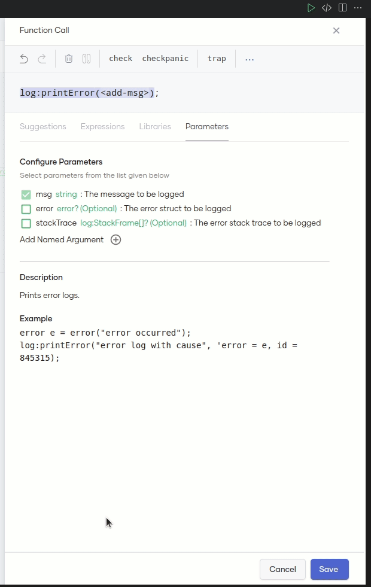

# Call a Ballerina library function using the Statement Editor

The Statement Editor allows you to easily navigate between Ballerina standard libraries and language libraries. The **libraries** tab in Statement Editor lists all the supported standard and language libraries.

This guide helps you to understand how to call a Ballerina library function using the Statement Editor.

Let's call the Ballerina [`printError`](https://lib.ballerina.io/ballerina/log/2.5.0/functions#printError) function of the [`log` module](https://lib.ballerina.io/ballerina/log/2.5.0) to log an error in the given sample code below.

```
public function main() returns error? {

    error e = error("something went wrong!");
    // Add the function call to log and error
}

```

Follow the steps below to build the log statement.

1. On the low-code diagram, click **+** within the main method. Then, click **Function** in the **Add Constructs** opened panel.

    

    The **Libraries** tab will be selected by default listing all the supported Ballerina libraries.

2. Search for **log** and select the `log` module. This will list all the supported functions, errors, records, types, etc. of the `log` module. Select the **log:printError** function.

    

    When you select a function or a method call, the **Parameters** tab opens by default. This tab displays information about the selected function or method call including details about the parameters, descriptions, and return type descriptions. On this tab, you can easily add parameters to the expression by selecting the checkboxes of the relevant parameters.

3. Double-click on the **`<add-mgs>`** template and type "error log".

    

    Now, follow the steps below to pass the **error - e** to the `printError` function.

4. Select the checkbox of the **error** from the parameter list. This will update the function with the correct syntax to add the error.

5. Go to the **Suggestions** tab and select **e**, which is the previously defined error.

    

You view the function call as follows without any diagnostics:

```
log:printError("error log", 'error = e);
```
Now, you have constructed a valid function-call via the Statement Editor.

6. Click **Save** to add the function call to the low-code diagram.
