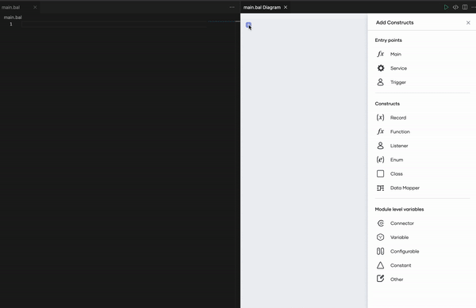
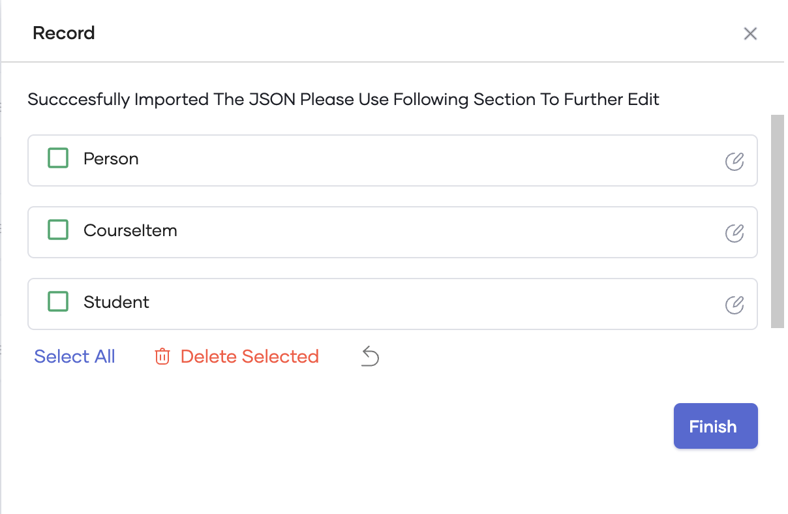

# Import JSON to records

The Ballerina language provides an option to convert JSON files into record definitions. Follow the steps below to create a record from a JSON.

1.  Create a file with the data below in JSON format.

    >**Info:** The example below converts a `person` and a list of `courses` to a `Student` record. 
    >
    ```
    {
        "person": {
            "id": 1001,
            "firstName": "Vinnie",
            "lastName": "Hickman",
            "age": 15
        },
        "course": [
            {
                "id": "CS6002",
                "name": "Computation Structures",
                "credits": 4
            },
            {
                "id": "CS6003",
                "name": "Circuits and Electronics",
                "credits": 3
            },
            {
                "id": "CS6004",
                "name": "Signals and Systems",
                "credits": 3
            }
        ]
    }
    ```

2. In the record editor, select **Import A JSON**.

3. Provide a name for the record.

4. Provide the sample JSON by either typing on the text area or by choosing the file created from the file selector.

5. Select **Make Separate Record Definitions** to create separate Ballerina record definitions.

    

6. Use the preview of the created record to edit the created records further, and click **Finish** once editing is complete.

    
