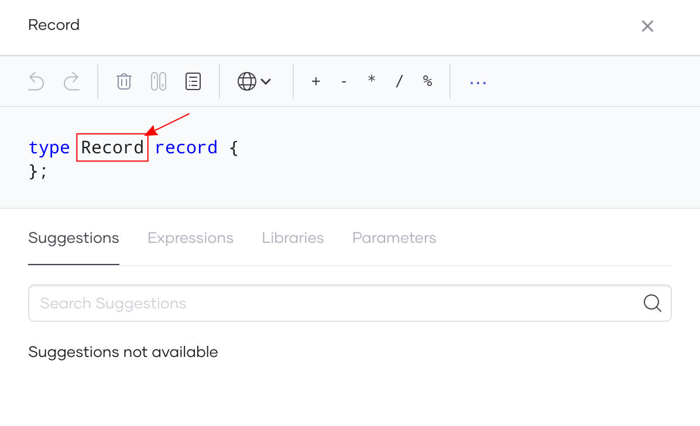
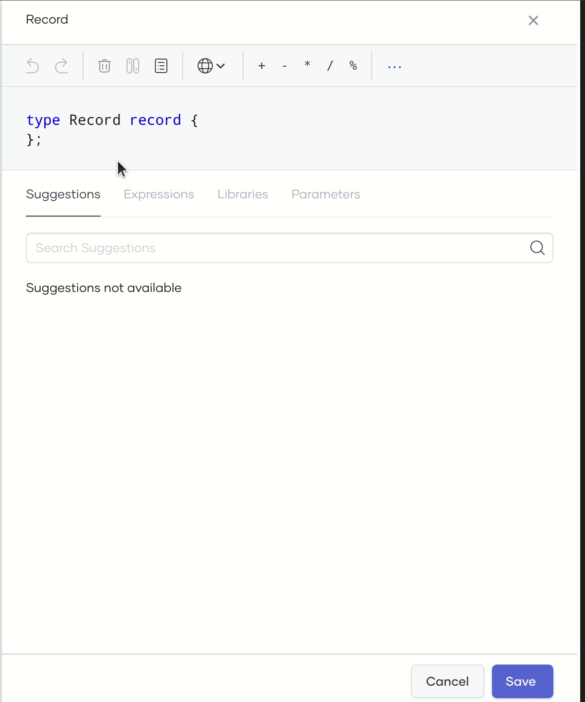
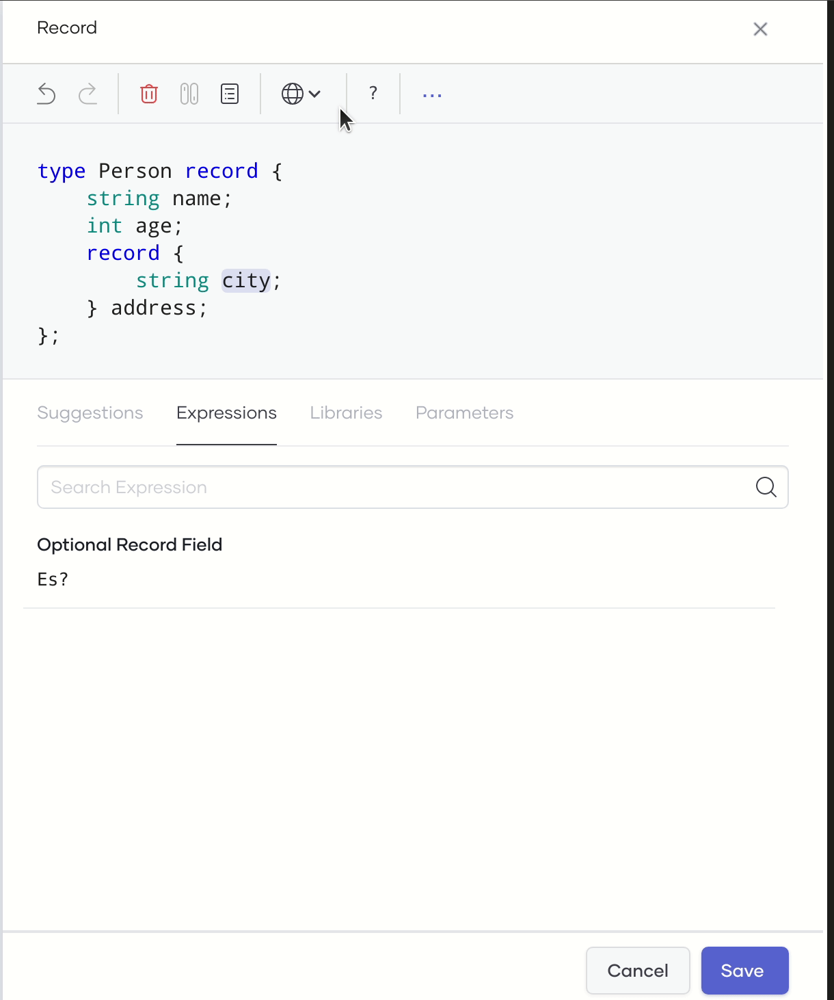
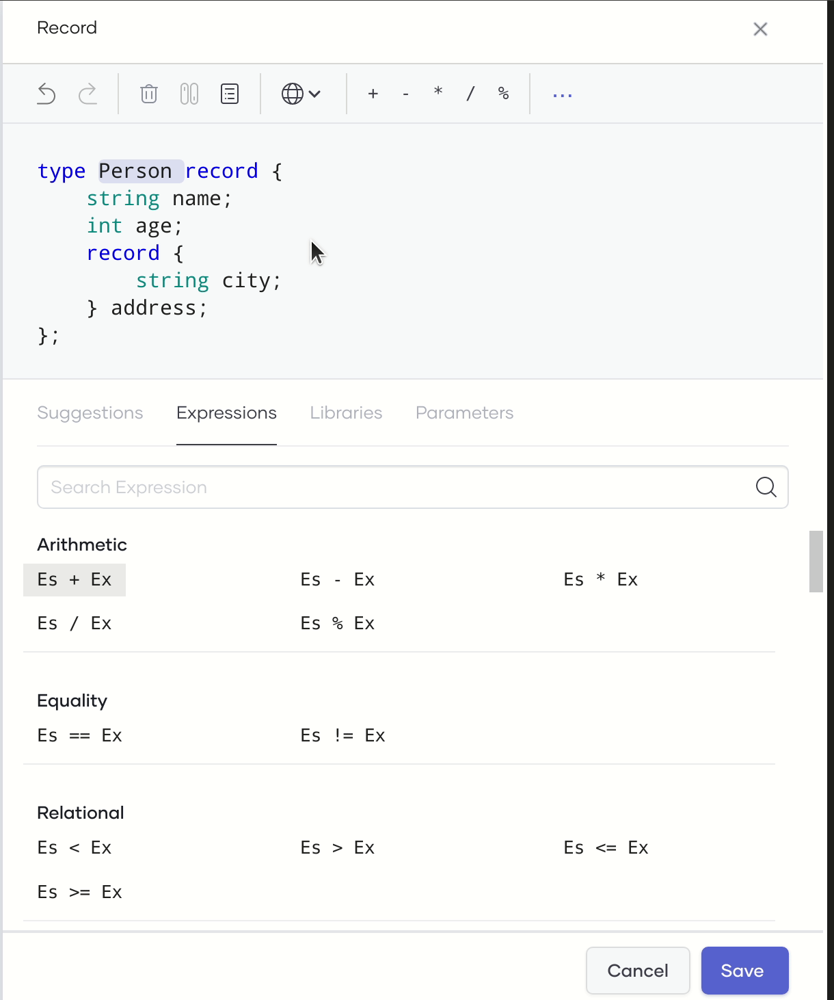
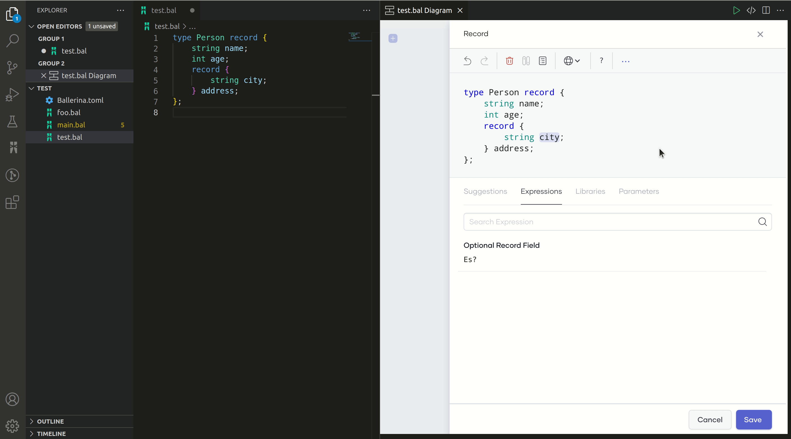

# Record editor

Record is the type system introduced by the Ballerina language to hold data by a user. You can use records when you want to define data schemas. Once the records are created, you can easily manipulate data inside a program.

Ballerina is a multi-paradigm language. You can define records in an imperative manner with Ballerina. On top of that, the Ballerina VS Code plugin comes with record editing capabilities, which will help you to edit records graphically.

In the record editor, you have the ability to create a record from scratch or create a record by importing a JSON.

## Set up the prerequisites

Follow the steps below to set up the prerequisites.

1. Install the latest versions of [Ballerina](https://ballerina.io/downloads/) and [Ballerina Visual Studio Code plugin](https://marketplace.visualstudio.com/items?itemName=wso2.ballerina).

2. Execute the command below to create a package (if you are not already working on one).

    ```bash
    bal new convert
    ```

3. Open the created package in VS Code.

## Create records from scratch

Follow the steps below to create records from scratch.

1. Navigate to the record editor and select **Create New**.

    

2. Double-click the default record name to change it.

    

3. Click the plus button at the end of the field to add new fields to the record.

    >**Info:** Use the **Expressions** tab in the record editor to create nested records by selecting the particular record expression.

    

4. Select the semicolon(;) of a field and select the default value expression to add default values.

    

5. Use the **isClosed** option to switch between the open and closed records.

    

6. Once the record field configuration is done, click **Save**.

    

