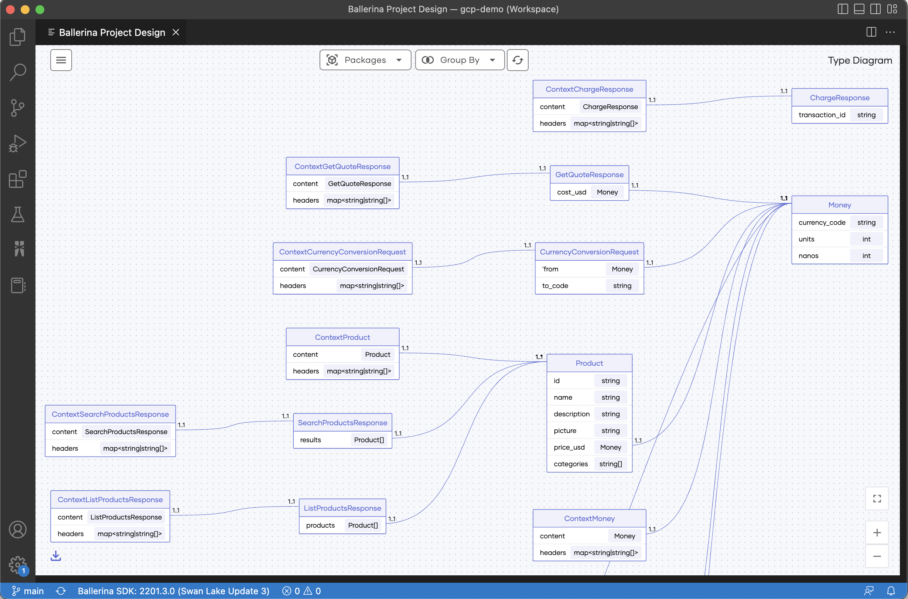

# Project Design Diagram

With the increasing size and complexity, software applications have evolved to be a composition of multiple interrelated components. When the number and/or depth of such components grow, it becomes necessary to have a overview of the system as a whole. The Ballerina project design view is deployed with the intention of providing a convenient way to generate a high-level picture of such applications, purely based on the source code. In addition to the component interactions, the project design view is also capable of visualizing the Ballerina record types in the project workspace and their associations.

## Set up the prerequisites

Install the latest versions of [Ballerina](https://ballerina.io/downloads/) and [Ballerina Visual Studio Code plugin](https://marketplace.visualstudio.com/items?itemName=wso2.ballerina).

The Ballerina Project Design View tool is packed with the latest release of the Ballerina VS Code plugin available in the VS Code marketplace. The diagrams can be generated upon executing the `Ballerina: Project Design` extension command. However, to get the best possible view of the project, it is necessary to setup the Ballerina project with the following concepts in mind.

## Related Concepts

### A Ballerina project

In the context of this tool, a Ballerina project is considered to be a collection of one or more Ballerina packages.

### A project workspace

In the context of this tool, a Ballerina project is contained by a [VS Code workspace](https://code.visualstudio.com/docs/editor/workspaces). Hence, the diagram generator is functional only if the Ballerina packages are added to the IDE as a workspace.
> **Tip:** You can save your VS Code workspace as a file and simply use this file to access the workspace thereafter.

### Service Identifiers

Since multiple services can have the same path, this tool depends on an additional annotation to uniquely identify the services within the project. The current approach to do so is via the `display` annotation, which is a general-purpose annotation that can be used in Ballerina code.

By providing a unique value to the `id` field of the display annotation, you can assign an identifier to each service. For reference, the `CurrencyService` in the following code snippet has been annotated with an ID of the value `currency`, and this identifier will be used to differentiate the service throughout the project.

```ballerina
@display {
   label: "CurrencyService",
   id: "currency"
}
@grpc:ServiceDescriptor {descriptor: ROOT_DESCRIPTOR, descMap: getDescriptorMapDemo()}
service "CurrencyService" on ep {final map<decimal> & readonly currencyMap;
   function init() returns error? {
      json currencyJson = check io:fileReadJson(currencyJsonPath);
      self.currencyMap = check parseCurrencyJson(currencyJson).cloneReadOnly();
   }

   remote function GetSupportedCurrencies(Empty value) returns GetSupportedCurrenciesResponse|error {
      return {currency_codes: self.currencyMap.keys()};
   }
}
```

If other services interact with this service, this same identifier has to be provided upon creating the client endpoint. By doing so, it makes it possible to uniquely identify and link the service interactions between one another. 

For example, the code snippet below calls on the `Currency Service` from a different component.

```ballerina
isolated function getSupportedCurrencies() returns string[]|error {
   @display {
      label: "CurrencyService",
   id: "currency"
   }
   final CurrencyServiceClient currencyClient = check new ("http://localhost:9093");
   GetSupportedCurrenciesResponse|grpc:Error supportedCurrencies = currencyClient->GetSupportedCurrencies({});
   if supportedCurrencies is grpc:Error {
      log:printError("failed to call getSupportedCurrencies from currency service");
      return supportedCurrencies;
   }
   return supportedCurrencies.currency_codes;
}
```

### Invoking service resources

The resource invocations between services need to be done using [client access actions](https://ballerina.io/downloads/swan-lake-release-notes/swan-lake-2201.2.0#support-for-resource-methods-in-client-objects).

## Explore the `Project Design View` features

For demonstration purposes, this guide will use the [Google Cloud Platform demo](https://github.com/ballerina-guides/gcp-microservices-demo/tree/project-design-demo) to explain the different capabilities of the diagram. This sample has 10 services (9 GRPC and one HTTP) in 10 separate Ballerina packages. The `ui folder` is not a Ballerina package, hence would not make an impact.

As discussed in the [Related Concepts](#a-project-workspace) section, each of these packages need to be loaded in to a VS Code workspace. This could be done using any of the following approaches.
1. Use the VS Code workspace file that is available in the repository OR
2. Add each Ballerina package to the workspace using the `Add folder to workspace` feature available VSCode

If the workspace has been set up accurately, you would be able to see the following folder structure in the explorer. However, do note that the workspace name would be different if you set up the workspace from scratch.


Once the workspace has been set up, the Ballerina design diagrams generator can be activated via the `Ballerina: Project Design` command. This command can be found in the VS Code command palette as seen below.


The execution of this command will open up a VS Code webview panel that will contain three types of design diagrams. The users can navigate between these diagrams using the side panel available on the diagram webview.

### Service Interaction Diagram

The service interaction diagram is the entry point of the project design diagrams tool. This diagram displays all the services available within the workspace with directed links representing any interactions between them. The service interaction diagram generated for the 10 Ballerina packages in the Google Cloud Platform demo project is seen below.


>**Info:** The directed link between the `Checkout` service and the `Email` service is an indication that a component in the `Checkout` service invokes the `Email` service. In addition to this, the `Email` service also invokes an `external` service via a connector.

### Detailed Service Interaction Diagram
The detailed service interaction diagram (Level 2) dives deeper into the compositions of the services and the interactions between them. The following diagram is the detailed representation of the demo project, and it depicts the individual resource/remote functions of the services and their invocations.


The data types of the request and response bodies of the interactions can be viewed by hovering over a particular invocation.


### Types Diagram

The types diagram provides a comprehensive view of all the Ballerina record types defined in the project workspace and their associations.

   

   >**Info:** The multiplicities of the associations are represented on either side of the connector while the [type inclusions](https://ballerina.io/learn/by-example/type-inclusion-for-records/) are differentiated using a directed link (represents inheritance).

In addition to the above diagrams, the tool also provides the capability to view the **composition** of an individual record type. These composition diagrams can be accessed by:
   1. Clicking on the record types that are included in the request/response bodies of service invocations shown in the [detailed service diagram](#detailed-service-interaction-diagram)
   2. Clicking on the head of the records displayed in the types diagram

The following is the composition diagram generated for the `ContextSearchProductsResponse` record type seen in the [types diagram](#types-diagram) above.
   
   


### Accessory features

In addition to the above, the Ballerina project design diagram tool also includes the following features.
   1. Filter the services and types based on the packages
   2. Rearrange the diagram as appropriate
   3. Export the diagrams in JPEG format
