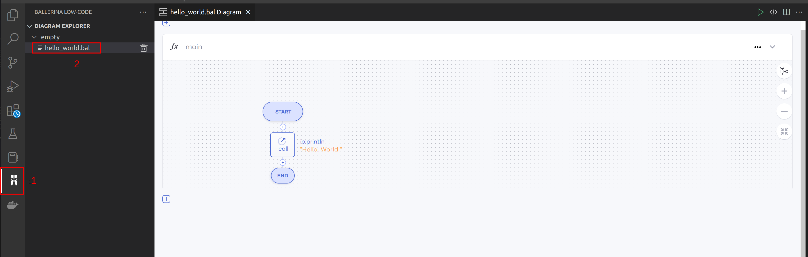

# Build and run the program

Follow the steps below to create a sample Ballerina program in VS Code. 

  
Code View

  >**Note:** Skip the 1-3 steps if you already have a Ballerina code.
  
1. Click **View** in the menu bar of the editor, and click **Command Palette**.

  >**Tip:** You can use the shortcut methods `⌘ + ↑ + P` on Mac and `Ctrl + Shift + P` on Windows and Linux.

2. In the search bar, type `Show Examples`, and click **Ballerina: Show Examples**.

3. Select the **Hello World Main** example.

4. Run the program

    ### Option 1
    Click on the **Run** code lens on the editor. 
    

    You just ran your first Ballerina program with a few clicks.

    >**Tip:** If you wish to debug further, you can either use the **Debug** code lens or see debugging guidelines.
    

    ### Option 2
    Click the run button on the editor’s title bar.
    

    >**Tip:** If you wish to debug further, you can either use the **Debug** button or see debugging guidelines.
    

  
Diagram View

  
  1. View diagram
  ### Option 1
  Click the **Show Diagram** button on the editor’s title bar to   view the graphical representation of the program.
  

  ### Option 2
  Click the Ballerina icon in vscode sidemenu to open the diagram explorer tree.
  

  2. Run the program

  Click the run button in diagram options menu.
  

  Alternatively, you can run by clicking the button on the title bar.
  

The integrated terminal will open automatically and run the program.
  
