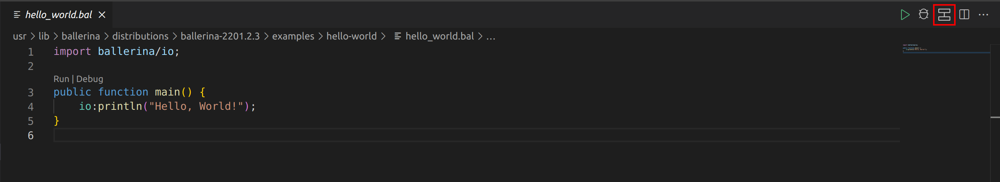
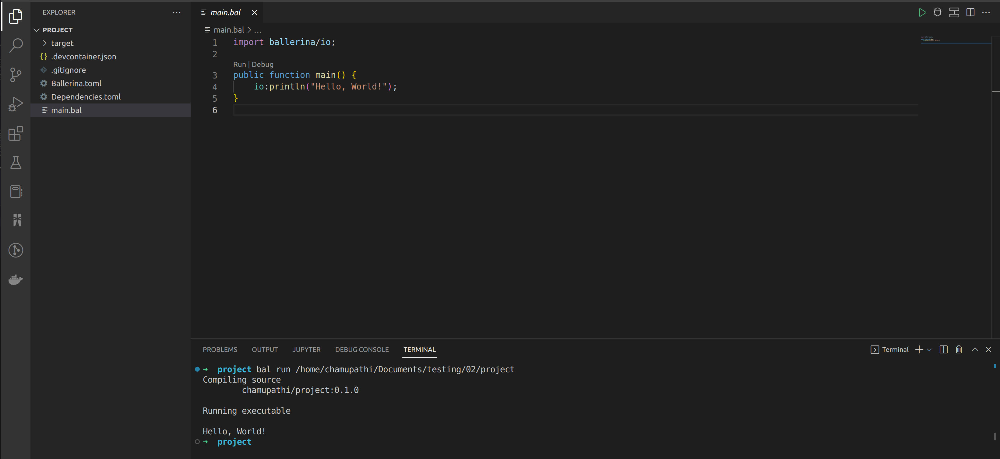

# Build and run the program

Follow the steps below to create a sample Ballerina program in VS Code. 

 

  
Code View

  >**Note:** Skip 1-3 steps if you already have a Ballerina code.
  
1. Click **View** in the menu bar of the editor, and click **Command Palette**.

  >**Tip:** You can use the shortcut methods `⌘ + ↑ + P` on Mac and `Ctrl + Shift + P` on Windows and Linux.

2. In the search bar, type `Show Examples`, and click **Ballerina: Show Examples**.

3. Select the **Hello World Main** example.

4. Run the program.

    ### Option 1
    Click on the **Run** code lens on the editor. 
    

    ### Option 2
    Click the **Run** button on the title bar of the editor.
    

 

  
Diagram View

  
  1. View the diagram
  ### Option 1
  Click the **Show Diagram** button on the title bar of the editor to view the graphical representation of the program.
  

  ### Option 2
  Click the Ballerina icon in the VS Code side menu to open the diagram explorer tree.
  

  2. Run the program

  Click the **Run** button in the diagram options menu.
  

  Alternatively, run the program by clicking the button on the title bar.
  

 

The integrated terminal will open automatically and run the program.
  

 

You just ran your first Ballerina program.
>**Tip:** If you wish to debug further, use  either the **Debug** button or see the [debugging guidelines](../debugging/debug.md).

# Try-it tools
The Ballerina VS Code extension allows you to try and debug an HTTP/GraphQL service (without using any third-party tools) while you develop it to check how it works. 
* [Swagger (HTTP) Try-it tool](tryit-tools/swagger-tool.md)
* [GraphQL Try-it tool](tryit-tools/graphql-tool.md)
