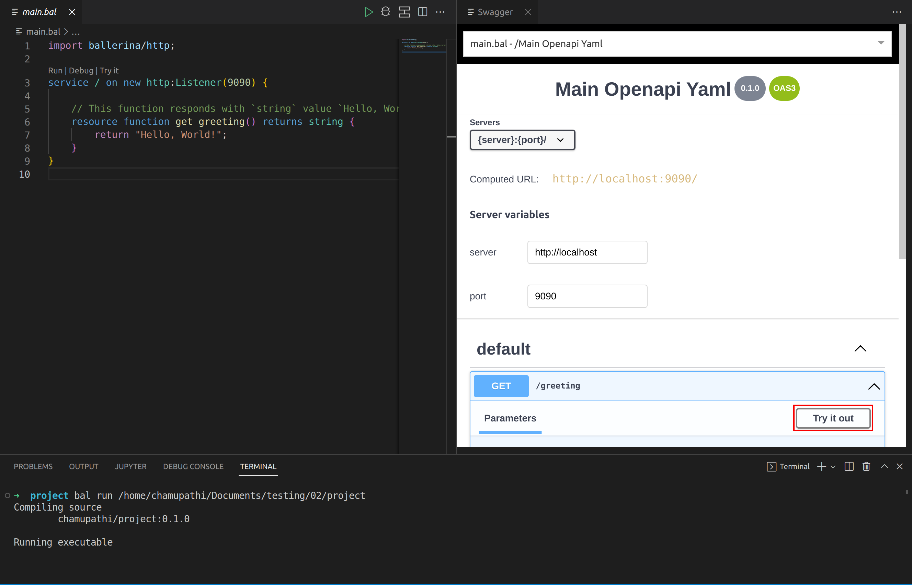

# Try HTTP services in Swagger view with Ballerina
While you develop an HTTP service, you need to try it and debug it to check how it works. The Ballerina VS Code plugin provides the Swagger Try it view, which gives the ability to try HTTP services within VS Code instead of using any third-party software.

## Write the HTTP service
Add the code below to the `main.bal` file.
```ballerina
import ballerina/http;

service / on new http:Listener(9090) {

    // This function responds with `string` value `Hello, World!` to HTTP GET requests.
    resource function get greeting() returns string {
        return "Hello, World!";
    }
}
    
```

## Try the HTTP service
Once you add the above function, the VS Code plugin will display a code lens called **Try it** on top of the service.

1. Click the **Run** code lens to run the program. 
    
    This opens the terminal and start running the service.

</br>

2. Click the **Try it** code lens to open the swagger Try it view.
   >**Note:** The service must be in the running state to use Try it view.

  

You can open the swagger view in Diagram view by clicking the try it button under the option menu.
  
  
</br>

3. Once the Swagger view is opened, click the **Try it out** button.
  

   >**Tip:** You can find all available APIs from the opened side menu.

</br>

4. Click the execute button to see the response.
  

   >**Info:** If the HTTP service require any data/paramter it will show parameters section.
   
