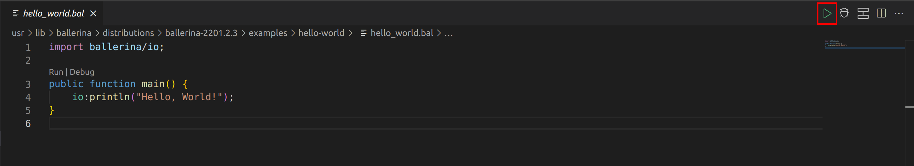
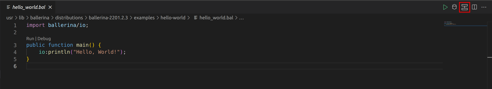
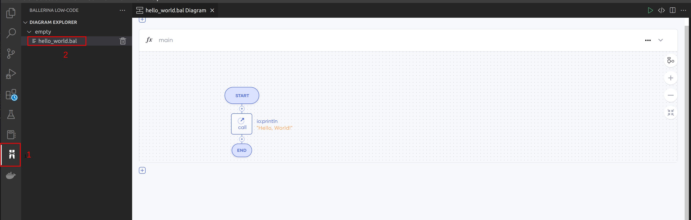
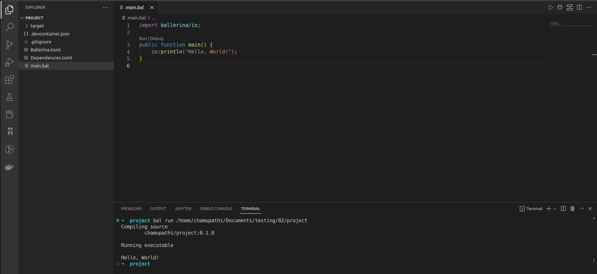

# Build and run the program

Follow the steps below to run a sample Ballerina program in VS Code. 

## Use the code view

>**Note:** Skip the steps 1-3, if you already have a Ballerina code.
  
1. Click **View** in the menu bar of the editor, and click **Command Palette**.

    >**Tip:** You can use the shortcut methods `⌘ + ↑ + P` on macOS and `Ctrl + Shift + P` on Windows and Linux.

2. In the search bar, type `Show Examples`, and click **Ballerina: Show Examples**.

3. Select the **Hello World Main** example.

4. Run the program.

    - **Option 1**
      
        Click on the **Run** CodeLens on the editor. 
      
        {.cInlineImage-full}

    - **Option 2**
    
        Click **Run** on the title bar of the editor.
      
        {.cInlineImage-full}

## Use the diagram view
  
1. View the diagram:

    - **Option 1**

        Click **Show Diagram** on the title bar of the editor to view the graphical representation of the program.
        
        {.cInlineImage-full}

    - **Option 2**

        Click the Ballerina icon in the VS Code side menu to open the diagram explorer tree.
        
        {.cInlineImage-full}

2. Run the program:

    - **Option 1**

        Click **Run** in the diagram options menu.

        {.cInlineImage-full}

    - **Option 2**
    
        Click **Run** on the title bar of the editor.

        {.cInlineImage-full}

The integrated terminal will open automatically and run the program.

{.cInlineImage-full}

You just ran your first Ballerina program.

>**Tip:** If you wish to debug further, use either **Debug** or see the [debugging guidelines](../debug-ballerina-code.md).
{.cInlineImage-full}

## Next steps - Try it

The Ballerina VS Code extension allows you to try out and debug HTTP/GraphQL services (without using any third-party tools) while you develop them. 

* [Try HTTP services in Swagger view](try-the-code/try-http-services.md)
* [Try GraphQL services](try-the-code/try-graphql-services.md)
