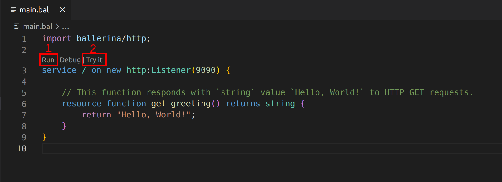
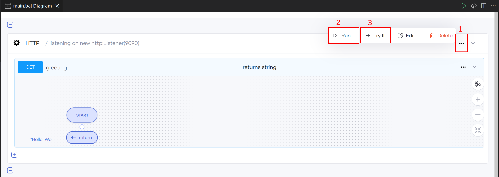
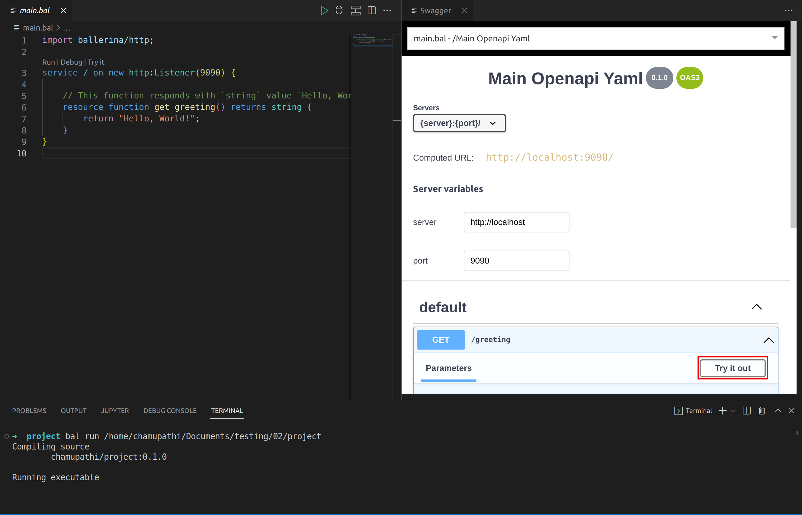
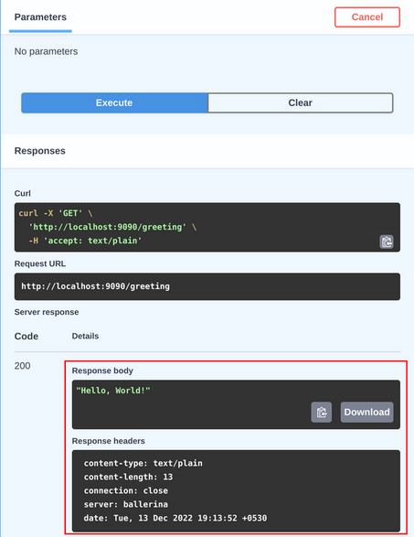

# Try HTTP services in Swagger view

While you develop an HTTP service, you need to try it and debug it to check how it works. The Ballerina VS Code extension provides the Swagger Try it view, which gives the ability to try HTTP services within VS Code instead of using any third-party software.

## Write the HTTP service

Add the code below to the `main.bal` file.

```ballerina
import ballerina/http;

service / on new http:Listener(9090) {

    // This function responds with the `string` value `Hello, World!` to HTTP GET requests.
    resource function get greeting() returns string {
        return "Hello, World!";
    }
}    
```

## Try the HTTP service

Once you add the above function, the VS Code extension will display a CodeLens called **Try it** on top of the service.

1. Click the **Run** CodeLens to run the program. 
    
    >**Info:** This opens the terminal and starts running the service.

2. Click the **Try it** CodeLens to open the Swagger Try it view.

    >**Note:** The service must be in the running state to use Try it view.

    {.cInlineImage-full}

    You can open the swagger view in the Diagram view by clicking **Try it** under the **Options** menu.
    
    {.cInlineImage-full}

3. Once the Swagger view is opened, click **Try it out**.

    >**Tip:** You can find all available APIs from the opened side menu.

    {.cInlineImage-full}

    

4. Click **Execute** to see the response.
    
    {.cInlineImage-half}

    If the HTTP service requires any data/parameters, they will be shown in the **Parameters** section.
    
    {.cInlineImage-full}
