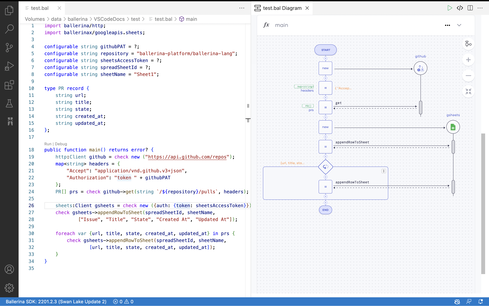

# Ballerina Extension for Visual Studio Code

The Visual Studio Code Ballerina extension provides a set of rich language features along with an enhanced user experience. It offers easy development, execution, debugging, and testing for the [Ballerina programming language](https://ballerina.io/). The Ballerina language possesses a bidirectional mapping between its syntaxes and the visual representation. You can visualize the graphical representation of your Ballerina source further via the extension.

For instructions on installing the Ballerina VS Code extension, see [Install the Ballerina extension](https://wso2.com/vscode-extentions/ballerina/get-started/install/).

