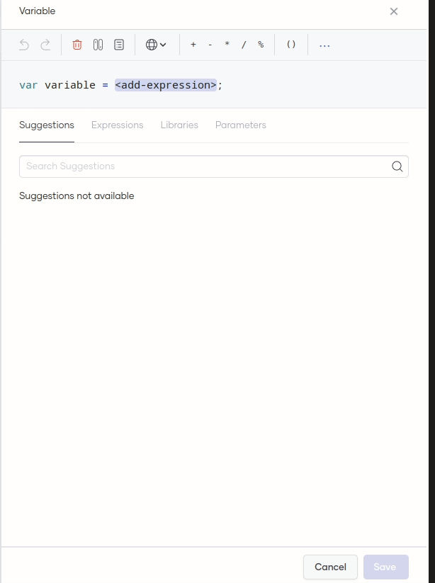
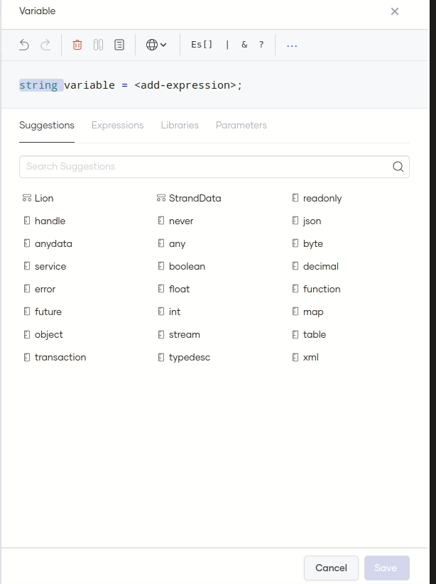
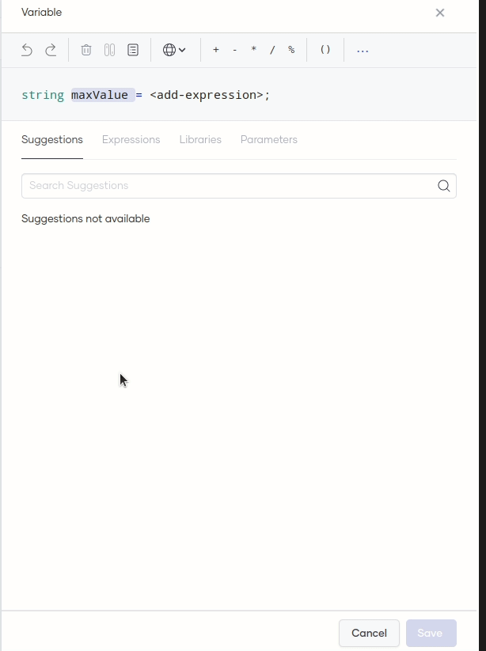
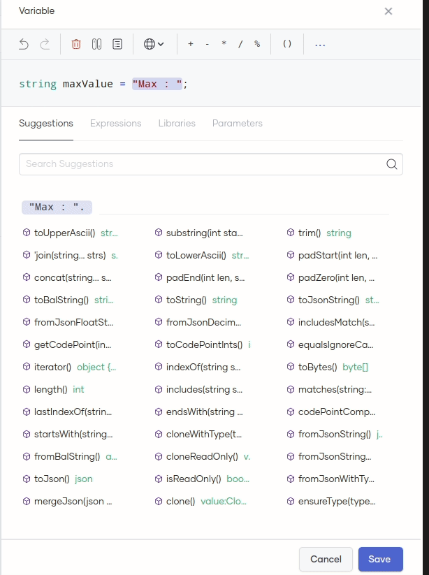
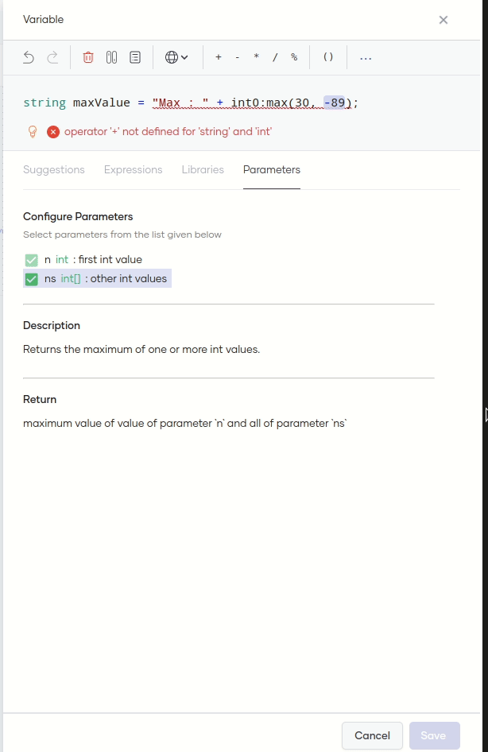

# Construct Statements using the Statement-Editor


The Statement-Editor allows you to construct Ballerina statements depending on the use case you want to build. It is an intuitive visual editor that is easy to use even without an in-depth knowledge of the [Ballerina Programming Language](https://ballerina.io/).

It provides the following:

- Context-based suggestions

- Ballerina libraries (standard libraries and language libraries)

- Pre-defined expression templates

- Documentation for functions and methods to easily configure parameters

This guide walks you through the steps to build the following statement using the editing capabilities in the Statement-Editor. Later we will explore different use cases.

```
final string userIdMsg = "UserID : " + id.toString();
```

Let's add the above statement to the main method of the given sample code below

```
int id = 1234;
 
public function main() returns error? {
   // Statement will be added here
}

```


To build the statement, follow these steps:

1. On the low-code diagram, click **+** within the main method. Then click **Variable** in the **Add Constructs** pane that opens.

    

    The Statement-Editor opens displaying the syntax for a variable statement with **`<add-expression>`** selected by default.

2. Click the **var** type descriptor on the statement and click **string** on the **Suggestions** tab.

    !!! info

        The **Suggestions** tab provides contextual suggestions based on the selected item. The **Suggestions** tab currently lists type suggestions because you selected the type descriptor.    

    

    Here, you are specifying that the variable value is a string.

3. To edit the variable name, double-click **`variable`** and type `userIdMsg` in the text box.

    !!! info

        Another way to make a part of a statement editable is to click on the required statement component and press  **Enter**/**Return**.

    

    !!! tip

    If you want to make changes to the content you have added to the statement, you can undo and redo your actions via the relevant icons on the top left of the toolbar. You can also remove content via the icon for deleting.

4. Double click **`<add-expression>`** and type `"UserID : "` in the text box.

    !!! info

        To navigate from one item on the statement to another, you can also press **Tab** or **Shift** + **Tab**.

    

    Here, you are entering static text as a part of the variable value.

5. To concatenate another expression to the String that we have added right now, we could follow two approaches
    1. Using the toolbar, click on **Plus (+)** operator.  OR
    2. Click **Expressions** tab, and under the Arithmetic section, click the **Es + Ex** expression.

    Both of these methods will append another expression template to the existing expression. 


    !!! info

        The **Expressions** tab lists all the pre-defined templates that you can use to define complex expressions.

    

    In the `Es + Ex` expression template, `Es` refers to the existing expression you clicked and selected. `+ Ex` combines another expression with `Es`.

6. Click **Suggestions** tab and click on the **id** suggestion.

    

     You will see some diagnostics generated for the suggestion you selected. Move on to the next step to resolve them. 

7. To solve the diagnostics you could follow two approaches.

    1. Statement editor provides **code-actions**, based on your preference you could select the options provided. To view the options, click on the bulb icon next to the diagnostic. OR
    2. Click the **Suggestions** tab. Click **toString()** in the suggestions list to convert the value to a string format.
    
    As you can see, the Suggestions tab will also provide other supported functions which can be called for the given expression.

    !!! info

     When you select a function or a method call, the **Parameters** tab opens by default. This tab displays information about the selected function or method call, including details about parameters, descriptions, and return type descriptions. On this tab, you can easily add parameters to the expression by selecting the checkboxes for the relevant parameters.

     

     Note that the Statement Editor has cleared all the diagnostics messages, indicating that the statement is valid.

     Now we need to make the variable a final. Let's follow the next steps.

8. Click on the globe icon in the toolbar and check on the **final** keyword. 

    !!! Info

    The dropdown shows the possible modifiers for the currently editing statement

     

     You will see the variable statement to be as follows:

     ```
     final string userIdMsg = "UserID : " + id.toString();
     ```
    
Congratulations! You have constructed a valid statement via the Statement-Editor!

You can click **Save** to add the variable statement to the low-code diagram.

To explore more on the statement-editor functionalities you could follow the uses cases linked below.

Featured use cases 

1. [Call a Ballerina library function](../references/call-a-ballerina-library-function.md)
2. [Create a record](../references/create-a-record-using-statement-editor)
3. [Define a configurable while developing another construct](../references/define-a-configurable-as-you-develop)
