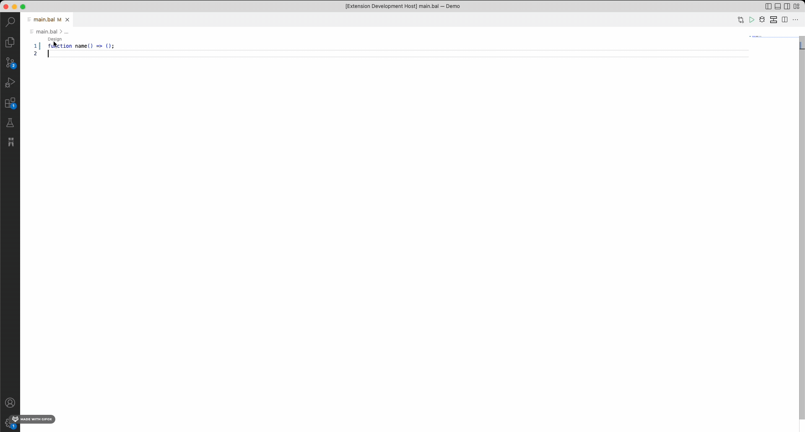
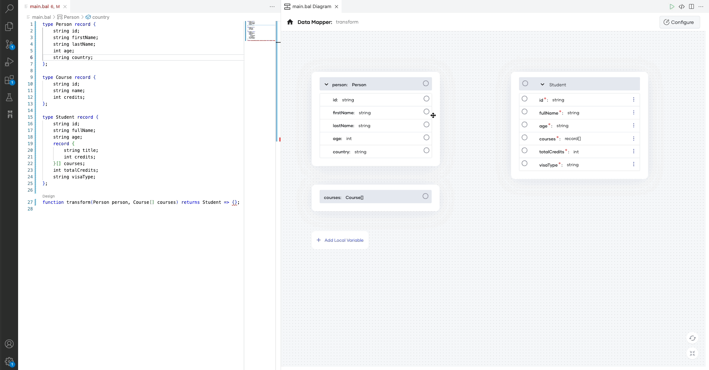
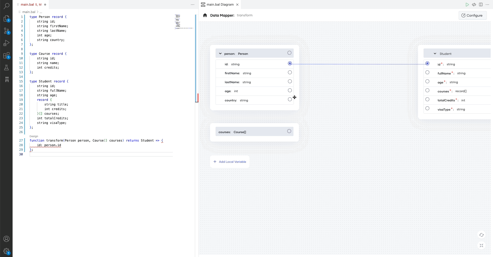
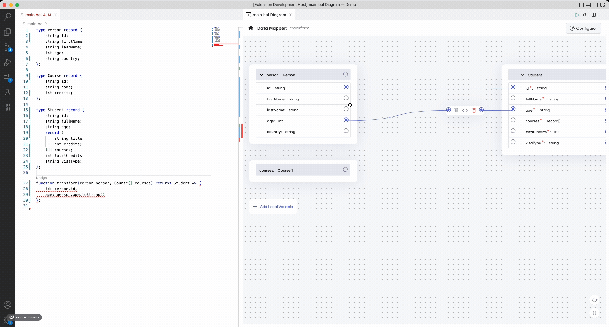
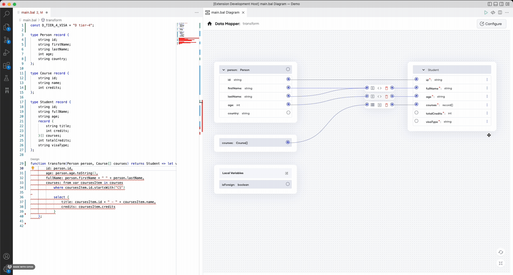

# Data Mapper

Data Mapper is a tool that allows you to visually translate data from one format to another (such as from one JSON format to another). It comes with an intuitive user interface and you don't need to be aware of the programming logic underneath.

When you map data via the user interface, the Data Mapper generates the required Ballerina source code. Since the Ballerina source code is the single source of truth for the visual Data Mapper, it allows you to edit existing data mappings made via the source code without changing the user experience.

## Sample use case

Given below is a simple use case where you input data of students and courses in a specific structure, which should be converted and transformed into a different format.

Create three files with the sample data below in JSON format.

**Input 1: Person**

```json
{
    "id": "1001",
    "firstName": "Vinnie",
    "lastName": "Hickman",
    "age": 15,
    "country": "UK"
}
```

**Input 2: Course**

```json
{
    "id": "CS6002",
    "name": "Computation Structures",
    "credits": 4
}
```

**Output**

```json
{
    "id": "1001F",
    "fullName": "Vinnie Hickman",
    "age": "15",
    "courses": [
        {"title": "CS6002 - Computation Structures", "credits": 4},
        {"title": "CS6003 - Circuits and Electronics", "credits": 3},
        {"title": "CS6004 - Signals and Systems", "credits": 3}
    ],
    "totalCredits": 10,
    "visaType": "D tier-4"
}
```

Given below is the source code for this data mapping sample. It contains the main function to invoke the transformation function with some sample data.

```ballerina
import ballerina/io;

type Person record {
    string id;
    string firstName;
    string lastName;
    int age;
    string country;
};

type Course record {
    string id;
    string name;
    int credits;
};

type Student record {
    string id;
    string fullName;
    string age;
    record {
        string title;
        int credits;
    }[] courses;
    int totalCredits;
    string visaType;
};

const D_TIER_4_VISA = "D tier-4";

var totalCredits = function(int total, record {string id; string name; int credits;} course) returns int => total + (course.id.startsWith("CS") ? course.credits : 0);

function transform(Person person, Course[] courses) returns Student => let var isForeign = person.country != "LK" in {
        id: person.id + (isForeign ? "F" : ""),
        age: person.age.toString(),
        fullName: person.firstName + " " + person.lastName,
        courses: from var coursesItem in courses
            where coursesItem.id.startsWith("CS")
            select {
                title: coursesItem.id + " - " + coursesItem.name,
                credits: coursesItem.credits
            },
        visaType: isForeign ? D_TIER_4_VISA : "n/a",
        totalCredits: courses.reduce(totalCredits, 0)
    };

public function main() {
    Person person = {
        id: "1001",
        firstName: "Vinnie",
        lastName: "Hickman",
        age: 15,
        country: "UK"
    };

    Course[] courses = [
            {
                id: "CS6002",
                name: "Computation Structures",
                credits: 4
            },
            {
                id: "CS6003",
                name: "Circuits and Electronics",
                credits: 3
            },
            {
                id: "CM1001",
                name: "Computational Statistics",
                credits: 4
            },
            {
                id: "CS6004",
                name: "Signals and Systems",
                credits: 3
            }
        ];

    Student student = transform(person, courses);
    io:println(student);
}

```

## Open the Data Mapper

There are two different ways of opening the Data Mapper.

-   Use the source code view.

    1.  Add the following code to the `main.bal` file of the package to define an empty expression-bodied function.

        >**Info:** The preferred way to model the transformation logic in Ballerina is via expression-bodied functions. The expression-bodied function below will simply return nil. The function body of it is an expression, which returns a nil value.

        ```ballerina
        function name() => ();
        ```

        You will now see a CodeLens called `Design` on top of the function.

    2.  Click the **Design** CodeLens to start configuring the Data Mapper.

        

-   Use the graphical view.

    Click the `+` icon to open the **Add Constructs** page, and then click **Data Mapper** to start configuring.

    

## Provide inputs and the output

When the Data mapper is opened, it will prompt you to give the input values and the expected output for the transformation function. Inputs and output can be any data type in Ballerina. This example converts an array of JSON to JSON, and thereby, you can use Ballerina record types for the inputs and output.

In the Data Mapper form, you have several options to provide the input and output records. If the records are already defined in your package, you can select one of those. If you are starting from scratch, you can either create the record from the **Record Editor** view or import a JSON to create a matching record.

This example imports JSON files and creates the records as shown below.


Once you define the input and the output types, click **Save** to open the mapping view. 

## Define the mappings

Let's see how to map the input fields with the fields in the JSON output.

### Basic mapping

Map the `person id` to the `student id` as shown below.

>**Info:** The mapping view will have the **Inputs** on the left-hand side of the UI and the **Output** on the right. To map the fields, click the input field port and then, click the output field port. If the input and output fields are compatible and can be mapped directly, you will see a solid line connecting them.



### Diagnose and fix mapping errors

Use the `toBalString` lang lib function to convert the integer to a string as shown below.

>**Info:** When you map the input fields to output fields, some of them might not be compatible due to type mismatch. In this example, if you map the `person age` to `student` age, it will result in a type mismatch error since the `input age` type is an integer, and the `output age` type is a string. In this case, the Data Mapper connects the two fields with a red line and shows an alert sign. You can see the error by hovering over the alert sign. In this case, it will show the `incompatible types: expected 'string', found 'int'` error. To fix the error, hover over the alert sign and click **Fix by editing expression**. Then, the Data Mapper prompts the expression editor for the specific expression. Now, you can modify the expression to return a string.



Once you fix the error, the connection appears in blue to indicate that there are no errors.

### Aggregate input and output fields

You can derive one output parameter by combining two or more input parameters. In this example, the value for the `fullName` output parameter is a combination of the values of the `firstName` and `lastName` input parameters. You can map them as shown below.

>**Info:** To aggregate fields, you can map two or more fields to the same output field. The Data Mapper will automatically combine the two fields and assign them to the output field. By default, the fields will be combined with a plus operator. If you want to use a different operator or method to combine two fields, you can click **Code** and customize the expression with the expression editor.



### Map the arrays

To convert from one array type to another, you can map the input array to the output array. If the arrays are compatible, they will be connected with a blue line. If they are incompatible, the connecting line will appear in red.

>**Info:** You can use Ballerina query support to convert one array type to another. To use a query in a Data Mapper, you can select the array by clicking on it. Then, it will provide several buttons. Click the code action button (bulb sign) and select **Convert to query**. Then, the Data Mapper will convert the mapping to a query. Then, move into the query and do the mapping between the array types.


#### Process the data further

You can further process the data within the query expression. Currently, the Data Mapper supports the following intermediate clauses:

- `Where` clause: filter data based on a given condition.
- `Let` clause: define local variables within the query expression.
- `Limit` clause: limit the number of elements returned from the query expression.
- `Order by` clause: sort data within the query expression in `ascending` or `descending` order.
- `Join` clause: performs an inner join.
- `Outer join` clause: performs left outer join.


Once the array type mapping is completed, select the transform function name at the top breadcrumb bar and navigate to the root view of mapping.

### Add local variables

You can define local variables within the transformation function and reuse them in multiple places to avoid duplications.

>**Info:** If there are no existing local variables, you can open up the local variable pane by clicking **Add Local Variable**. Otherwise, the defined local variables are listed under **local variables** in the UI. You will be able to access the local variable pane by clicking **Edit**.


### Manipulate fields without drawing connections

Click the triple dots at the end of the field to see the actions that can be performed for the selected field.

#### Initialize arrays, add, and delete elements

>**Info:** The actions are provided based on the type of the selected field. If you click the triple dots button of an array-type field, you will see the **Initialize Array** option.

Once the array is initialized, you can add array elements by clicking **+ Add Element**.
Furthermore, clicking the triple dots on any array element will provide the option to delete that element.


#### Add/Edit constant values/expressions 

>**Info:** If a particular field is empty and accepting a constant/expression, you will see the **Add value** action after clicking the triple dots. This will open up the expression editor and you will be able to provide a constant value or construct any complex expression in it.

Let's add a hard-coded visa type for foreign students.



>**Info:** If a particular field is having a value, you will see the **Edit value** action once you click the triple dots.

Let's add an 'F' suffix to the `student id` of each foreign student.


Finally, let's fill in the `totalCredits` field by getting the summation of the credits in each CS course.
You can use the [`reduce()`](https://lib.ballerina.io/ballerina/lang.array/0.0.0/functions#reduce) array function for this by passing the combining function below to get the sum.

```ballerina
var totalCredits = function(int total, record {string id; string name; int credits;} course) returns int => total + (course.id.startsWith("CS") ? course.credits : 0);
```


Now, you have successfully configured the transformation function using the Data Mapper.