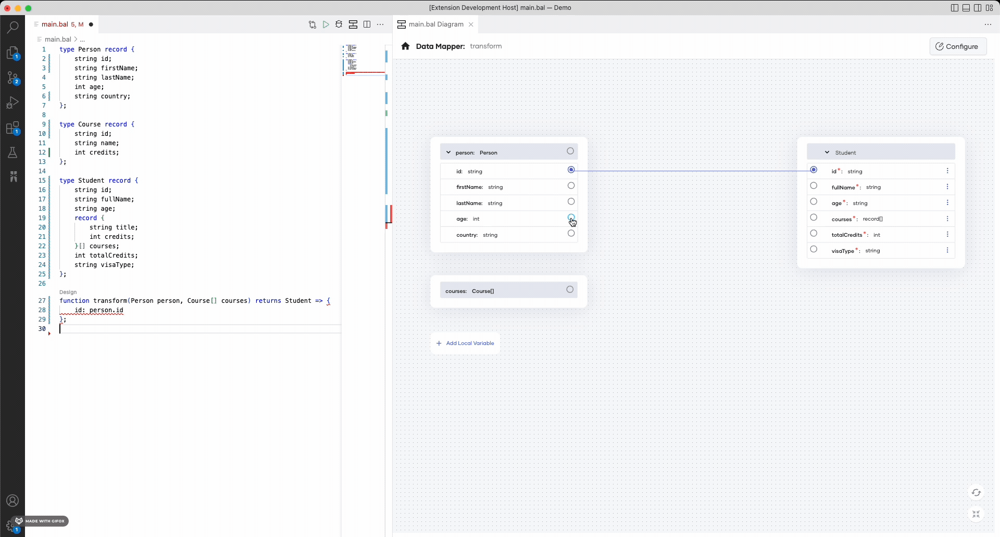
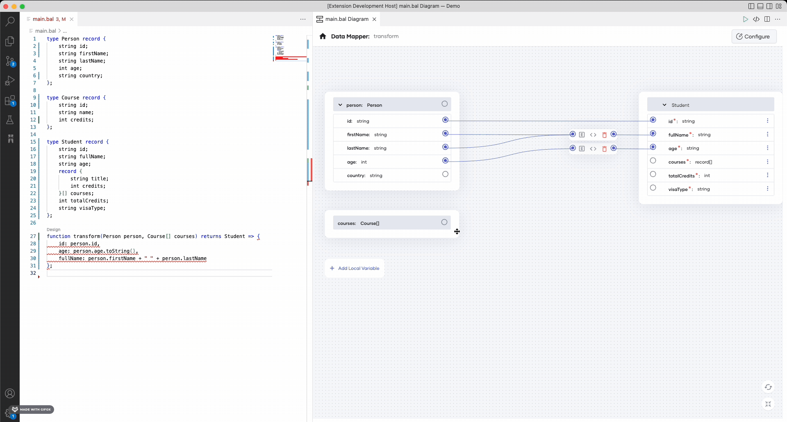

# Data Mapper

Visual Data Mapper is a tool, which allows you to visually translate data from one format to another (such as from one JSON format to another). It comes with an intuitive user interface and prevents the need of being aware of the programming logic underneath.

When you map data via the user interface, the Data Mapper generates the required Ballerina source code. Since the Ballerina source code is the single source of truth for the Visual Data Mapper, it also lets you open and edit existing data mappings made via the source code without changing the user experience.

## Set up the prerequisites

1. Install the [latest Ballerina version](https://ballerina.io/downloads/) and the [Ballerina Visual Studio Code extension](https://marketplace.visualstudio.com/items?itemName=wso2.ballerina).
2. Execute the command below to create a package (if you are not already working on one).
```bash
bal new convert
```
3. Open the created package in VS Code.

### Sample use case
The below is a simple use case in which you will input data of people and courses in a specific structure and convert and transform those to a different format.

4. Create three files with the sample data below in JSON format.

**Input 1: Person**
```json
{
    "id": "1001",
    "firstName": "Vinnie",
    "lastName": "Hickman",
    "age": 15,
    "country": "UK"
}
```
**Input 2: Course**
```json
{
    "id": "CS6002",
    "name": "Computation Structures",
    "credits": 4
}
```
**Output**
```json
{
    "id": "1001F",
    "fullName": "Vinnie Hickman",
    "age": "15",
    "courses": [
        {"title": "CS6002 - Computation Structures", "credits": 4},
        {"title": "CS6003 - Circuits and Electronics", "credits": 3},
        {"title": "CS6004 - Signals and Systems", "credits": 3}
    ],
    "totalCredits": 10,
    "visaType": "D tier-4"
}
```

## Open the Data Mapper
There are two different ways of opening the Data Mapper.
1. Open with the `Design` code lens.

Add the code below to the `main.bal` file of the package to define an empty expression bodied function.

>**Info:** The preferred way to model the transformation logic in Ballerina is via expression-bodied functions. The expression-bodied function below will simply return nil. The function body of it is an expression, which will return a nil value.

```ballerina
function name() => ();
```
Once you add the above function, the VS Code extension will display a code lens called `Design` on top of the function. Click the **Design** code lens to go to the Data Mapper view.


2. Open with the Diagram View.

Open the file in the Diagram View and click the `+` icon on the page. Then, click **Data Mapper** in the **Add Constructs** pane.


## Provide inputs and output
Once the Data mapper is opened, it will prompt you to provide inputs and output of the transformation function. Inputs and the output can be any data type in Ballerina. This example converts JSON and array of JSON to JSON, and thereby, you can use Ballerina record types as inputs and output.

In the Data Mapper form, you have several options to provide the input and output records. If the records are already defined in your package, you can select one of those. If you are starting from scratch, you can either create the record from the Record Editor view or import a JSON to create a matching record.

This example imports JSON files and creates the records as shown below.


Once you define the input and the output types, click **Save** to open the mapping view. 

## Define the mappings

Let's see how to map the input fields with the fields in the JSON output.

### Basic Mapping
Map the `person id` to the `student id` as shown below.
>**Info:** The mapping view will have the **Inputs** on the left hand side of the UI and the **Output** on the right. To map the fields, click on the input field port and then, click the output field port. If the input and output fields are compatible and can be mapped directly, you will see a solid line connecting them.


### Diagnose and fix mapping errors
Use the `toBalString` lang lib function to convert the int to string as shown below.

>**Info:** When you map the input to an output fields, some of them might not be compatible due to type mismatch. In this example, if you map the `person age` to `student` age, it will result in an error for type mismatch since the `input age` type is an integer and `output age` type is string. In this case, the Data Mapper will connect the two fields with a red line and show an alert sign. You can see the error by hovering over the alert sign. In this case, it will show `incompatible types: expected 'string', found 'int'`. To fix the error, hover over the alert sign and click `Fix by editing expression`. Then, the Data Mapper will pop out the expression editor for the specific expression. Now, you can modify the expression to return a string.



Once you fix the error, the connection appears in blue to indicate that there are no errors.

### Aggregate multiple input fields to one output field
You can derive one output parameter by combining two or more input parameters. In this example, the value for the fullName output parameter is a combination the values for the firstName and lastName input parameters. You can map them as shown below:
>**Info:** To aggregate fields, you can map two or more fields to the same output field. The Data Mapper will automatically combine the two fields and assign it to the output field. By default, the fields will be combined with a plus operator. If you want to use a different operator or method to combine two fields, you can click on the code button and customize the expression with the expression editor.


### Map the arrays
To convert from one array type to another, you can simply map the input array to the output array. If the arrays are compatible, they will be connected with a blue line. If they are not compatible, the connecting line will appear in red.

>**Info:** You can use Ballerina query support to convert one array type to another. To use a query in a Data Mapper, you can select the array by clicking on it. Then, it will provide you with several buttons. Click the code action button (bulb sign) and select **Convert to query**. Then, the Data Mapper will convert the mapping to a query. Then, move into the query and do the mapping between the array types.



#### Further process the data
You can further process the data within the query expression. Currently, the Data Mapper supports the following intermediate clauses.
- Where clause: filter data based on a given condition
- Let clause: define local variables within the query expression
- Limit clause: limit the number of elements returns from the query expression
- Order by clause: sort data within the query expression in `ascending` or `descending` directions
- `Join` clause: performs an inner or left outer join
- Outer join clause: performs an outer join


Once array type mapping is completed, select the transform function name in the top breadcrumb bar to navigate to the root view of mapping.

### Add local variables
You can define local variables within the transformation function and re-use in multiple places to avoid duplications.
>**Info:** If there are no existing local variables, you can open up the local variable pane by clicking on the `Add Local Variable` button. Otherwise, the defined local variables are listed down under local variables in the RHS of the UI. You will be able to access the local variable pane by clicking on the edit button there.


### Manipulate fields without drawing connections
Click on the triple dots button at the end of the field to see the actions that can be performed for the selected field.

#### Initialize arrays, Add and delete elements
>**Info:** The actions are provided based on the type of the selected field. If you have click on the triple dots button of an array typed field, you will see `Initialize Array` option.

Once the array is initialized, you can add array elements by clicking on the `+ Add Element` button.
Furthermore, clicking the triple dots button on any array element will provide the option to delete that element.


#### Add/Edit constant values/expressions 
>**Info:** If a particular field is empty and accepting a constant/expression, you will see the **Add value** action after clicking the triple dots button. This will open up the expression editor and you will be able to provide a constant value or construct any complex expression in it.

Let's add a hard-coded visa type for foreign students.


>**Info:** If a particular field is having a value, you will see the **Edit value** action once you click the triple dots button.

Let's add an 'F' suffix to the `student id` of each foreign student.


