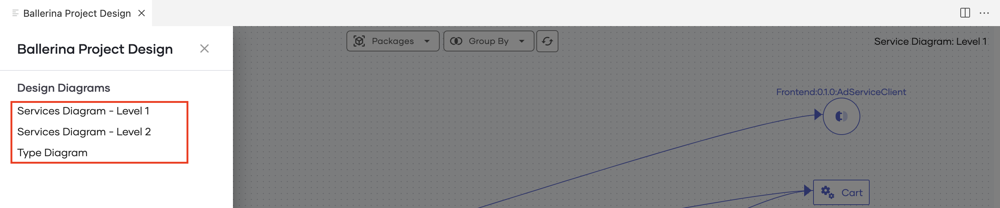

# Project Design view

Software applications have evolved into a composition of multiple interrelated components to be able to handle increasing complexities. When the number and/or depth of such components grow, it is convenient to have a high-level picture of the system components and their interactions. 

The Ballerina Project Design view is enabled in the VS Code extension to provide such a high-level picture of Ballerina projects purely based on the source code. In addition to the component interactions, the Project Design view is also capable of visualizing the Ballerina record types in the project workspace and their associations.

## Related concepts

When you create your Ballerina project, be mindful of the following concepts, as they will affect the Project Design view.

### Ballerina project

A Ballerina project is a collection of one or more [Ballerina packages](https://ballerina.io/learn/package-references/).

### Project workspace

A Ballerina project is contained in a [VS Code workspace](https://code.visualstudio.com/docs/editor/workspaces). To use the Design Diagram view, you need to have all the Ballerina packages added to the VS Code editor as a workspace.

!!! Tip
    You can save your VS Code workspace as a file and use this file to access the workspace thereafter.

### Service identifiers

Since multiple services can have the same path, this tool depends on an additional annotation to uniquely identify the services within the project. The current approach to do so is via the `display` annotation, which is a general-purpose annotation that can be used in Ballerina code.

By providing a unique value to the `id` field of the display annotation, you can assign an identifier to each service. For reference, the `CurrencyService` in the following code snippet has been annotated with an ID of the `currency` value and this identifier will be used to differentiate the service throughout the project.

```ballerina
@display {
   label: "CurrencyService",
   id: "currency"
}
@grpc:ServiceDescriptor {descriptor: ROOT_DESCRIPTOR, descMap: getDescriptorMapDemo()}
service "CurrencyService" on ep {final map<decimal> & readonly currencyMap;
   function init() returns error? {
      json currencyJson = check io:fileReadJson(currencyJsonPath);
      self.currencyMap = check parseCurrencyJson(currencyJson).cloneReadOnly();
   }

   remote function GetSupportedCurrencies(Empty value) returns GetSupportedCurrenciesResponse|error {
      return {currency_codes: self.currencyMap.keys()};
   }
}
```

If other services interact with this service, this same identifier has to be provided upon creating the client endpoint. By doing so, it makes it possible to uniquely identify and link the service interactions between one another. 

For example, the code snippet below invokes the `Currency Service` from a different component.

```ballerina
isolated function getSupportedCurrencies() returns string[]|error {
   @display {
      label: "CurrencyService",
   id: "currency"
   }
   final CurrencyServiceClient currencyClient = check new ("http://localhost:9093");
   GetSupportedCurrenciesResponse|grpc:Error supportedCurrencies = currencyClient->GetSupportedCurrencies({});
   if supportedCurrencies is grpc:Error {
      log:printError("failed to call getSupportedCurrencies from currency service");
      return supportedCurrencies;
   }
   return supportedCurrencies.currency_codes;
}
```

### Service resources

The resource invocations between services need to be done using [client access actions](https://ballerina.io/downloads/swan-lake-release-notes/swan-lake-2201.2.0#support-for-resource-methods-in-client-objects).

## Open the Project Design view

Let's use the [Online Boutique microservices demo](https://github.com/ballerina-guides/gcp-microservices-demo) to demonstrate the different capabilities of the Design Diagram. This sample has 10 services (9 GRPC and one HTTP) in 10 separate Ballerina packages. The `ui` folder is not a Ballerina package, hence would not make an impact. 

To set up a Ballerina project as a VS Code workspace, add all the Ballerina packages to the workspace using one of the following methods: 

1. Add each Ballerina package to the workspace using the **Add folder to workspace** option in the VS Code editor. 

    !!! Info 
        When the workspace is set up, you will see the following folder structure in the **Explorer**. The workspace name may be different if you set up the workspace from scratch.

      {.cInlineImage-small} 

2. Use the **VS Code workspace file** from an already created workspace to import its packages to a new workspace.

    !!! Info 
        The [workspace file](https://github.com/ballerina-guides/gcp-microservices-demo/blob/main/project.code-workspace) of the Online Boutique microservices demo is available in the repository.          

Once the packages are added to the workspace, activate the Ballerina Design Diagram generator via the `Ballerina: Project Design` command in the command palette, as shown below.

   {.cInlineImage-full}

## Explore the Project Design view

Let's explore the features of the Design Diagram using the [Online Boutique microservices demo](https://github.com/ballerina-guides/gcp-microservices-demo) Ballerina project that you set up in the previous topic.

When you open the Design Diagram as explained in the previous topic, you will see three types of design diagrams to choose from as shown below. 

{.cInlineImage-full}

### Service Diagram: Level 1

This diagram displays all the services available within the workspace with links representing any interactions between them. The basic Service Diagram (level 1) generated for the 10 Ballerina packages in the Online Boutique microservices demo project is shown below.

{.cInlineImage-full}

!!! Info
    The link between the `Checkout` service and the `Email` service indicates that a component of the `Checkout` service invokes the `Email` service. In addition to this, the `Email` service also invokes an `external` service via a connector.

### Service Diagram: Level 2

The detailed Service Diagram (Level 2) dives deeper into the compositions of the services and the interactions between them. Shown below is the detailed representation of the demo project, which depicts the individual resource/remote functions of the services and their invocations.

{.cInlineImage-full}

The data types of the request and response bodies of the interactions can be viewed by hovering over a particular invocation.

{.cInlineImage-full}

### Type Diagram

The **Type Diagram** provides a comprehensive view of all the Ballerina record types defined in the project workspace and their associations.

{.cInlineImage-full}

!!! Info
    The multiplicities of the associations are represented on either side of the connector, while the [type inclusions](https://ballerina.io/learn/by-example/type-inclusion-for-records/) are differentiated using a directed link (represents inheritance).

###   Composition Diagram

You can also view the **composition** of an individual record type. These composition diagrams can be accessed by:

-  Clicking the record types that are included in the request/response bodies of the service invocations shown in the [detailed service diagram](#service-diagram-level-2).

-  Clicking the head of the records displayed in the **Type Diagram**.

The following is the composition diagram generated for the `ContextSearchProductsResponse` record type seen in the [Type Diagram](#type-diagram) above.
   
{.cInlineImage-full}

### Other capabilities

In addition to the above, the Ballerina Project Design tool includes the following features.

- Filter the services and types based on the packages
- Rearrange the diagram as appropriate
- Export the diagrams in JPEG format
