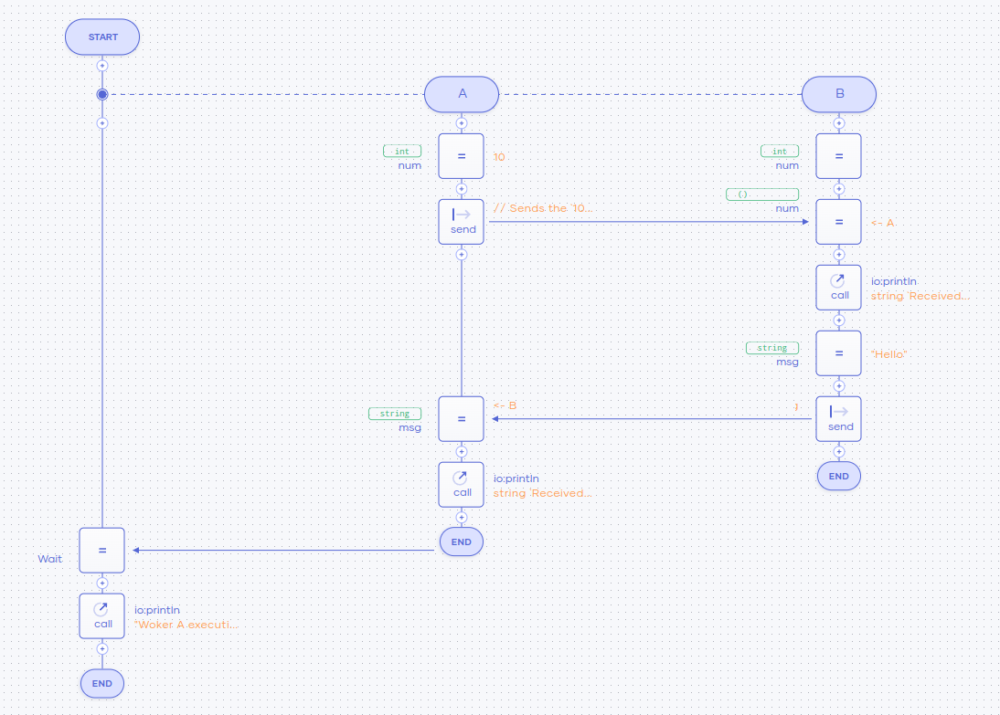

# Sequence diagram view
With Ballerina, you can view your code in a graphical mode and develop your program logic through it. This
allows you to look at your program logic holistically and gives you the ability to comprehend the program at 
a glance. This visual representation has its roots in sequence diagrams and can capture how the logic of
the program flows, how the concurrent execution flow works, which remote endpoints are involved, and how they interact 
with the different objects in the program.

## Switching to graphical mode
There are two methods for switching to the graphical mode using the VS Code extension.

- Execute the `Ballerina: Show Diagram` command from the command palette.
    
- Click the `Show Diagram` button in the editor group.
    

## Graphical representation of code

### Functions
Graphical representations of functions are based on sequence diagrams. Each function has a lifeline with a start and 
end and this lifeline represent the flow of the function logic. 


### Concurrent execution
Concurrent executions are supported in Ballerina through workers. Each worker has a lifeline that runs parallel to 
the lifeline of the main function body. The diagram also captures asynchronous messaging between workers.

The following example shows a sample of messages passing between workers and waiting in the main function until the 
execution is finished.

```ballerina
public function FunctionWithWorker() {
    worker A {
        int num = 10;

        // Sends the `10` integer value to the `B` worker asynchronously.
        num -> B;

        // Receives the `Hello` string from the `B` worker.
        string msg = <- B;
        io:println(string `Received string "${msg}" from worker B`);
    }

    worker B {
        int num;

        // Receives the `10` integer value from the `A` worker.
        num = <- A;
        io:println(string `Received integer "${num}" from worker A`);

        // Sends the `Hello` string to the `A` worker asynchronously.
        string msg = "Hello";
        msg -> A;
    }

    wait A;
    io:println("Woker A execution finished");
}
```


### Remote endpoints and clients
Ballerina has support to specify interactions with remote endpoints through its syntax. This ability also 
translates into the graphical representation giving each endpoint its lifeline to represent the messages that it 
can receive.

The following code shows an HTTP client that is used to the `GET` and `POST` requests sent to a remote endpoint.

```ballerina
function execute() returns error? {
    http:Client lookupService = check new (lookupUrl);
    http:Client reportService = check new (reportUrl);

    json result = check lookupService->get("/query");
    http:Response response = check reportService->post("/report", result);
}
```


## Developing programs in the visual mode
You can interact with the diagram using the `plus` icons placed in the lifeline. You can add a statement at the 
function execution flow by clicking the **Add**.


