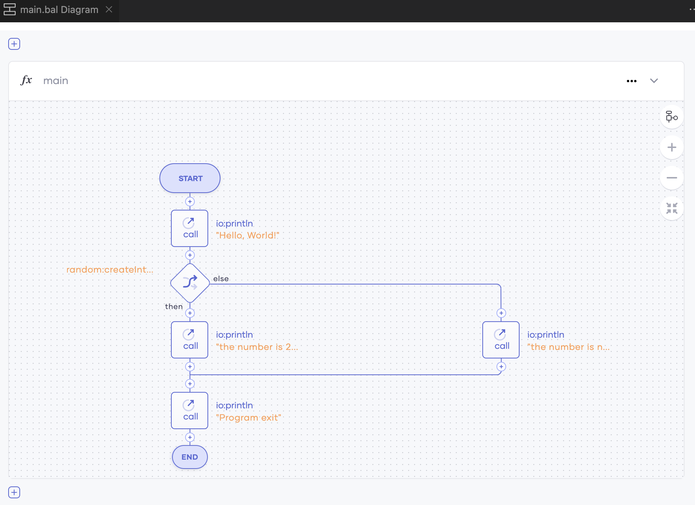
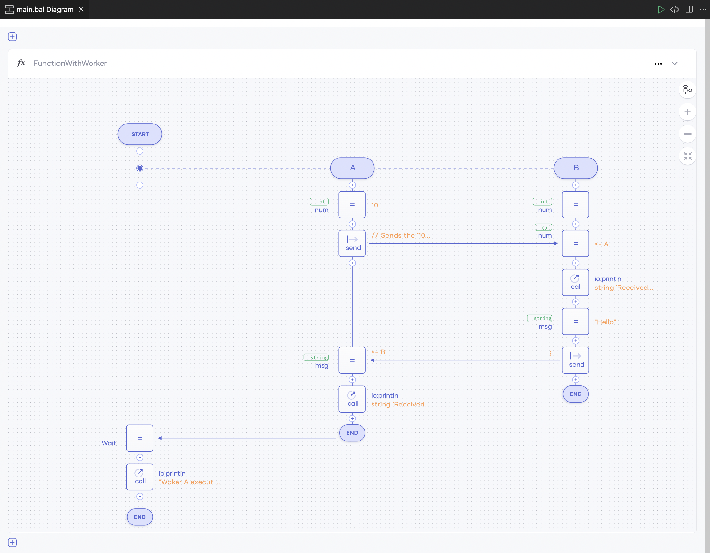

# Sequence Diagram view

When you use the Ballerina VS Code extension, you can view your code in graphical mode and develop your program logic through it. This
allows you to look at your program logic holistically and comprehend the program at a glance. 

This visual representation has its roots in sequence diagrams and can capture how the logic of your program flows, how the concurrent execution flow works, which remote endpoints are involved, and how those endpoints interact with the different objects in the program.

## Switch to graphical mode

There are two methods for switching to the graphical mode using the VS Code extension.

-   Execute the `Ballerina: Show Diagram` command from the command palette.
    
    {.cInlineImage-half}

-   Click `Show Diagram` in the editor group.
    
    {.cInlineImage-full}

Shown below is the code editor and graphical editor in view.

{.cInlineImage-full}

## Graphical representation of code

Ballerina code can be represented graphically in the following ways.

### Functions

Graphical representations of functions are based on sequence diagrams. Each function has a lifeline with a start and end, and this lifeline represents the flow of the function logic. 

**Source code**

```ballerina
import ballerina/io;
import ballerina/random;

public function main() {
    io:println("Hello, World!");

    if random:createIntInRange(1, 100) == 22 {
        io:println("the number is 22");
    } else {
        io:println("the number is not 22");
    }

    io:println("Program exit");
}
```

**Graphical view**
    
{.cInlineImage-full}

### Concurrent execution

Concurrent executions are supported in Ballerina through workers. Each worker has a lifeline that runs parallel to 
the lifeline of the main function body. The diagram also captures asynchronous messaging between workers.

The following example shows how asynchronous messaging is represented in the diagram.

**Source code**

```ballerina
public function FunctionWithWorker() {
    worker A {
        int num = 10;

        // Sends the `10` integer value to the `B` worker asynchronously.
        num -> B;

        // Receives the `Hello` string from the `B` worker.
        string msg = <- B;
        io:println(string `Received string "${msg}" from worker B`);
    }

    worker B {
        int num;

        // Receives the `10` integer value from the `A` worker.
        num = <- A;
        io:println(string `Received integer "${num}" from worker A`);

        // Sends the `Hello` string to the `A` worker asynchronously.
        string msg = "Hello";
        msg -> A;
    }

    wait A;
    io:println("Woker A execution finished");
}
```

**Graphical view**

{.cInlineImage-full}

### Remote endpoints and clients

Ballerina specifies interactions with remote endpoints through its syntax. These interactions are presented graphically in the diagram view by giving each endpoint a lifeline. This endpoint lifeline represents the messages that the endpoint can receive.

The following code shows an HTTP client that is used for the `GET` and `POST` requests sent to a remote endpoint.

**Source code**

```ballerina
function execute() returns error? {
    http:Client lookupService = check new (lookupUrl);
    http:Client reportService = check new (reportUrl);

    json result = check lookupService->get("/query");
    http:Response response = check reportService->post("/report", result);
}
```

**Graphical view**

{.cInlineImage-half}

## Develop programs in graphical mode

You can interact with the diagram using the `plus` icons placed in the lifeline. You can add a statement at the 
function execution flow by clicking **Add**.

{.cInlineImage-full}

## Related topics

See the following topics to explore graphical coding further.

- [Data Mapper](data-mapper.md)
- [Project Design view](project-design-view.md)